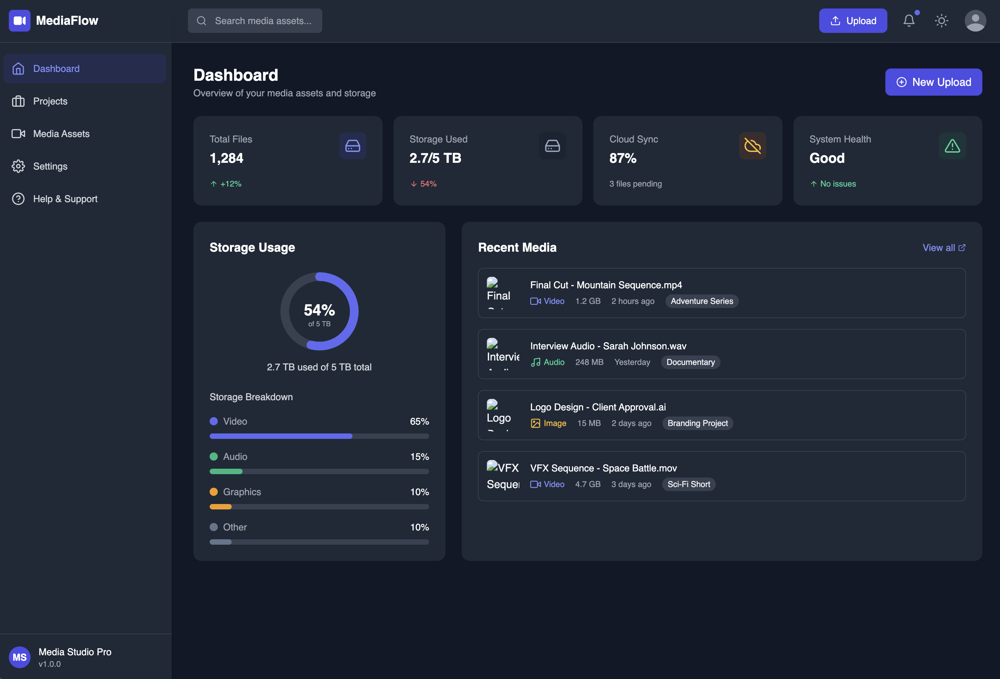
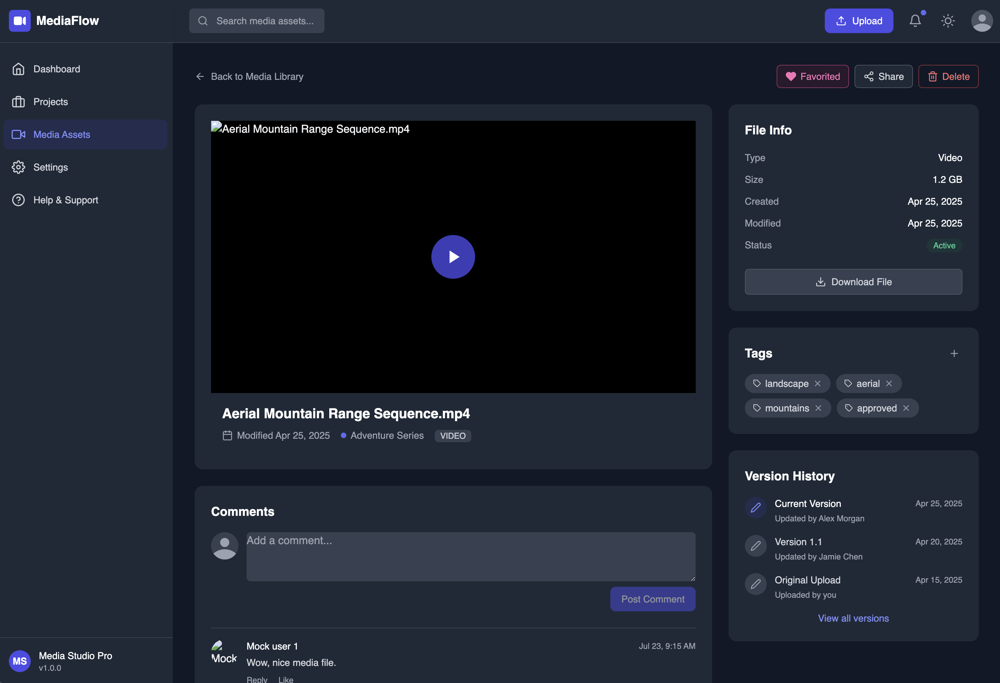

# MediaFlow

MediaFlow is a showcase React application that demonstrates modern front-end architecture and UI/UX design principles for a cloud-based media asset management platform. This project is a design prototype that highlights thoughtful component structure, responsive layouts, and attention to detail in user experience.



---



## Purpose

This project was created to demonstrate front-end development expertise and design thinking. While it's not intended for production use, it showcases:

- **Component Architecture**: Structured, modular approach to building React applications
- **UI/UX Design**: Thoughtful user flows and interface design
- **Clean Code Practices**: Well-organized, readable, and maintainable code patterns
- **TypeScript Implementation**: Strong typing for improved developer experience and code quality
- **Responsive Design**: Adaptive layouts for all device sizes

## Technical Stack

- **Framework**: React 18 with TypeScript
- **Build Tool**: Vite for fast development and optimized production builds
- **Styling**: TailwindCSS with custom theming
- **State Management**: React Hooks with Context
- **Testing Setup**: Vitest and React Testing Library
- **Code Quality**: ESLint, Prettier, and Husky for pre-commit hooks

## Architectural Highlights

- **Atomic Design Principles**: Components built from small, reusable pieces
- **Feature-Based Organization**: Files structured by feature for better maintainability
- **Theme System**: Complete dark/light mode support with smooth transitions
- **Responsive Layouts**: Mobile-first approach to UI design
- **Accessibility Considerations**: Semantic HTML and ARIA attributes

## Design Features

- **Dashboard View**: Data visualization and quick access to recent files
- **Media Browser**: Grid and list views with filtering capabilities
- **Project Management**: Organization of media files by project
- **Detail Views**: Complete information and metadata for individual assets
- **Loading States**: Loading placeholders for improved user experience

## Getting Started

This is a demonstration project that showcases UI development skills. To explore the codebase:

```bash
# Clone the repository
git clone https://github.com/caseyshiring/mediaflow.git
cd mediaflow

# Install dependencies
npm install

# Start the development server
npm run dev
```

## Project Structure

The codebase is organized into logical, feature-based components:

- **/components/common**: Reusable UI elements
- **/components/layout**: Page structure components
- **/components/dashboard**: Dashboard-specific components
- **/components/media**: Media management components
- **/hooks**: Custom React hooks
- **/utils**: Helper functions and utilities

## Development Philosophy

This project embodies modern front-end development principles:

- **Declarative UI**: React components that describe what to render
- **Separation of Concerns**: Clear boundaries between UI, logic, and state
- **Progressive Enhancement**: Core functionality works in all environments
- **Micro-interactions**: Small details that enhance the user experience
- **Performance Optimization**: Efficient rendering and resource usage

## Note on Functionality

This is primarily a UI prototype demonstrating front-end skills. While the interface is fully implemented, backend functionality is simulated with mock data. In a production environment, this would connect to real APIs for data persistence and cloud storage functionality.
